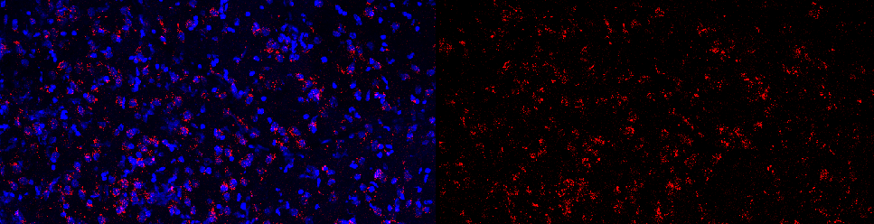

---

###Postdoctoral Fellow
####University of Wisconsin - Milwaukee  
####The Department of Psychology
####Milwaukee, Wisconsin  
####trask@uwm.edu

<a href="https://twitter.com/Sydney_Trask?ref_src=twsrc%5Etfw" class="twitter-follow-button" data-show-count="false">Follow @Sydney_Trask</a>

---

I am interested in the ways the brain encodes, stores, retrieves, and updates memory. I am particularly interested in understanding memory for context, or the environment in which events take place. Successful encoding and retrieval of context allows us to select and guide our behavior in a way that encourages situationally appropriate responding. However, alterations in this type of learning and memory are common in symptomology that underlies several neuropsychiatric disorders, ranging from PTSD to age-related dementia. Understanding how memory for context is formed, retrieved, and altered at both the circuit and molecular level, will provide one crucial step forward to treatments aimed at reducing maladaptive behaviors stemming from contextually inappropriate behaviors. 

___

###[__Download CV__](pubs/CV Trask.pdf)

___ 

